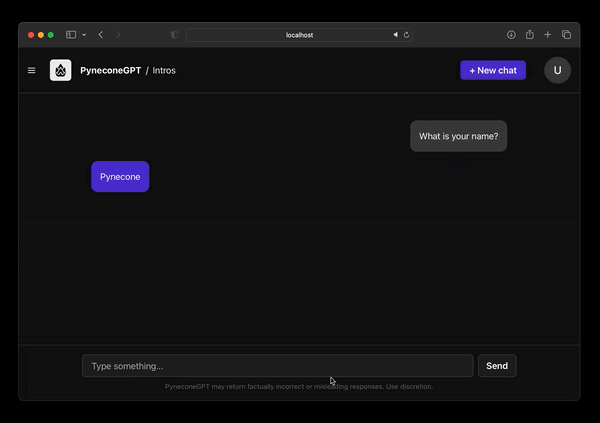

<<<<<<< HEAD
# Reflex Chat App
A user-friendly, highly customizable Python web app designed to demonstrate LLMs in a ChatGPT format.
<div align="center">

</div>


# Getting Started

### 🧬 1. Clone the Repo

```
git clone https://github.com/reflex-dev/reflex-chat.git
```
### 📦 2. Install Reflex
To get started with Reflex, you'll need:

Python 3.7+
Node.js 12.22.0+ (No JavaScript knowledge required!)
Install Reflex using pip:

```
$ pip install reflex
```
### 🚀 3. Run the application
Navigate to the llm-web-ui directory, initialize and run the app:

```
$ cd reflex-chat/webui
$ reflex init
$ reflex run
```

# Features
- 100% Python-based, including the UI, using Reflex
- Create and delete chat sessions
- The application is fully customizable and no knowledge of web dev is required to use it.
    - See https://reflex.dev/docs/styling/overview for more details 
- Easily swap out any LLM
- Responsive design for various devices

# Contributing

We welcome contributions to improve and extend the LLM Web UI. 
If you'd like to contribute, please do the following:
- Fork the repository and make your changes. 
- Once you're ready, submit a pull request for review.

# License
The following repo is licensed under the MIT License.
=======
1. `cd nevschat`
2. `docker build -t reflex-project:latest .`
3. `docker run --rm -p 3000:3000 -p 8000:8000 reflex-project:latest
>>>>>>> 6b6dd64 (first commit)
