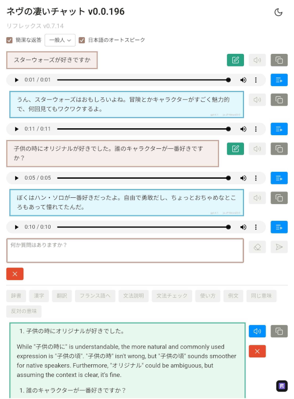

# Nev's Awesome ChatGPT

This is my private thing that I use everyday, deployed at
[www.nevdelap.com/chat](http://www.nevdelap.com/chat) (behind auth), because it
does exactly what I want and nothing else.



## Prerequisites

```bash
paru -Sy unzip
```

## From Scratch

```bash
mkdir -p ~/miniconda3 &&
cd ~/miniconda3 &&
wget https://repo.anaconda.com/miniconda/Miniconda3-latest-Linux-x86_64.sh \
  -O miniconda.sh &&
bash miniconda.sh -b -u -p ~/miniconda3 &&
rm miniconda.sh &&
mkdir ~/nevschat &&
cd ~/nevschat &&
git clone git@github.com:nevdelap/droplet.git &&
git clone git@github.com:nevdelap/nevschat.git &&
cd nevschat &&
git submodule init &&
git submodule update &&
scripts/install_dev
```

## Update Reflex

```bash
cd reflex &&
git fetch &&
git checkout v0.4.6 &&
cd .. &&
git add reflex &&
git commit -m 'Update reflex.' &&
pip install -e reflex
```

## Run The App In Dev

```bash
cd app &&
reflex run # Test at http://localhost:3000/
```

## Release On DigitalOcean

This shows `scripts/lint` being run manually though it can be run automatically
with `scripts/install_hooks`.

```bash
git add . &&
git commit -m 'whatever' &&
scripts/lint &&
git merge latest &&
git push origin HEAD:master --no-verify &&
git tag -f latest &&
git push -f origin latest --no-verify &&
ssh_droplet bash -c "scripts/deploy && sleep 30 && scripts/logs"
```

### General Info

#### Documentation

* [Reflex Component Library](https://reflex.dev/docs/library/)
* [Radix  UI](https://www.radix-ui.com/)
  * [Icons](https://lucide.dev/icons)
  * [Colors](https://www.radix-ui.com/colors)

#### OpenAI

The OpenAI key is supplied in the OPENAI_API_KEY environment variable. It should
be [configured](https://platform.openai.com/settings/organization/limits) with a
monthly budget and email notification when it is exceeded.

### Google TTS

The Google TTS API key is supplied the GOOGLE_TTS_KEY environment variable. It
should be [restricted](https://console.cloud.google.com/apis/credentials) to be
usable only for the Cloud Text-to-Speech API, only only from the production and
development IP addresses.

#### Page structure

* nevschat.py
  * vstack
    * title
    * chat (in chat.py)
    * cancel X
* chat.py
  * chat
    * vstack contains
      * wrap with the checkboxes, radio buttons, and dropdowns.
      * foreach has the previous prompts_responses each rendered by
        prompt_response_box.
      * hstack has the next prompt with buttons.
  * prompt_response_box
    * has a conditional, rendering a prompt as being edited, or not edited with
      buttons.
    * if not being edited and is being generated renders a cancel button next to
      the response.
